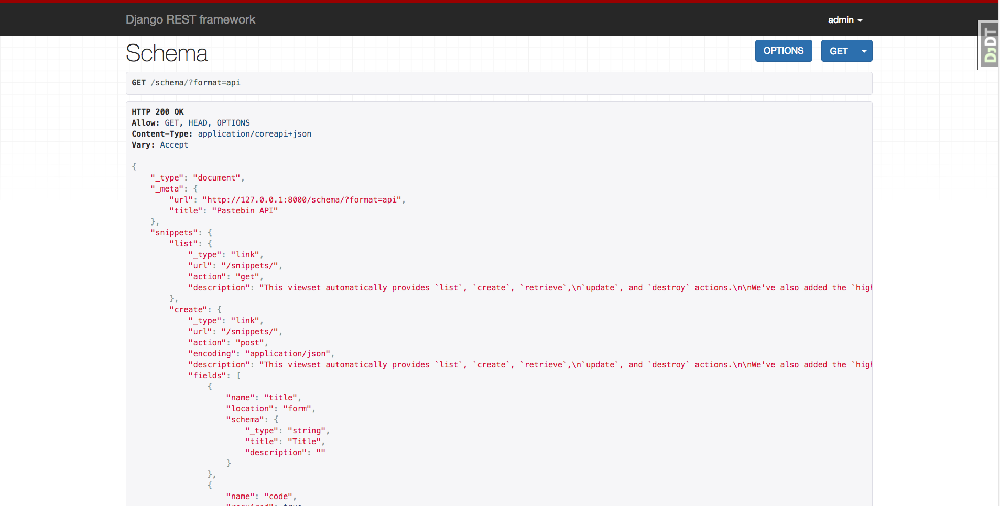
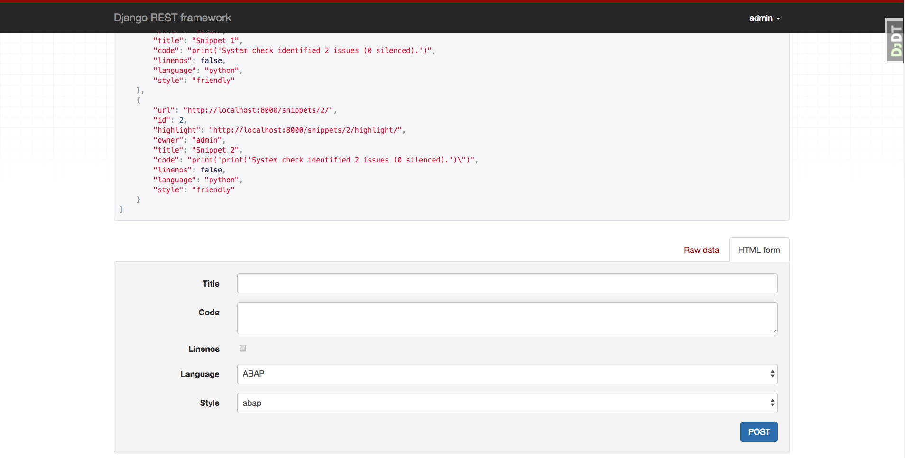

Django RESTful API Sandbox
===

## Introduction

This is a Django application that uses the Django RESTful API library. It uses both the function-based views and class-based views.

This API stores and colorizes code snippets. Users can create, edit, update, and share code snippets. When authenticated, users can edit code snippets they've created and view all other code snippets.

## Screenshots

### A schema breakdown of the API

### A sample post request of code snippets and a form for POSTing data

## Installation

To install, create a virualenvironment which uses Python 3, install the `requirements.txt` file, and run the application with `python manage.py runserver`.